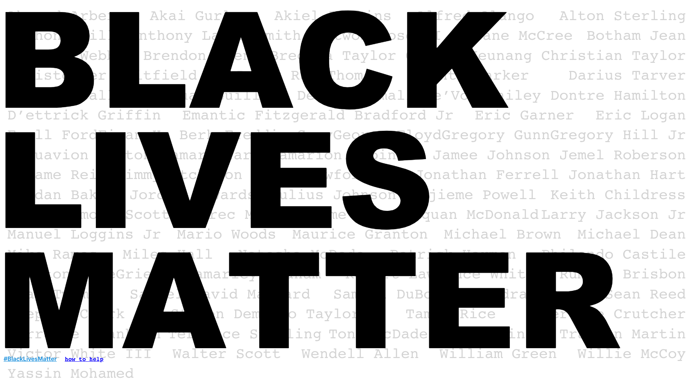

# BLM

Spread awareness of what's going on right now. Links for helping out #blm movement, hashtag links as well as more information about police violence in the US.

## Getting started

Just download one of the releases and upload contents of the zip files to your web server. The website requires **no** server side processing, it's only HTML and Javascript.

## Make changes

Run `npm run build` and upload the contents of `/build` to your web server.

## Requirements

None, just upload the prebuilt website files to your web server

## PR

All pull requests are welcome, please explain what you did and why you did it. Thank you. 

## Create React App Stuff

This project was bootstrapped with [Create React App](https://github.com/facebook/create-react-app).

## Available Scripts

In the project directory, you can run:

### `yarn start`

Runs the app in the development mode. 
Open [http://localhost:3000](http://localhost:3000) to view it in the browser.

The page will reload if you make edits. 
You will also see any lint errors in the console.